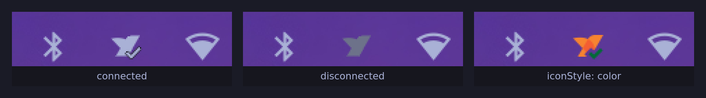

# NetBird Omarchy Widget

Omarchy bar widget for [NetBird](https://netbird.io), modeled on the
first-party `omarchy.tailscale` widget: the same bar icon, the same
keyboard-driven popup, the same power switch in the hero, and the same copy
menus. Everything it knows comes from the `netbird` CLI.



## Features

- Shows the NetBird daemon's state in the bar, with the connected/total peer
  count in the bar tooltip and in the hero
- Left click opens a keyboard-friendly panel
- Right click toggles NetBird on/off, middle click refreshes
- Hero line carries the management host and how long the current session has
  left ("session expires in 1d 6h")
- This device's FQDN, NetBird address, and relay availability on one row, with
  a copy menu
- Every peer from `netbird status --json`, sorted by name, each with a status
  glyph — bright for `Connected`, dimmed for `Connecting` and `Idle`, crossed
  for `Disconnected`. Lazy connections leave healthy peers idle for hours, so
  an online-only list would look like an empty network.
- Copy a peer's name, FQDN, or NetBird address
- SSO login: when the daemon needs to re-authenticate, the widget runs
  `netbird up --no-browser`, picks the login URL out of its output, and hands
  it to `omarchy-launch-browser`. The device code the CLI prints is shown
  large in the panel with a copy button and a cancel button beside it.
- Filter the peer list with `/` — matches name, FQDN, address, transport and
  state, and the section header counts what is showing
- Tells you when the **daemon itself** is not running, instead of showing a
  stale peer list
- **Networks**: every route the daemon offers, with a switch per row and
  select/deselect-all in the header
- **Per-peer detail**: why a peer is relayed — transport and relay, the
  negotiated ICE pair, last handshake, transfer, latency, advertised routes
- Expandable **relay list** behind the relay count, showing which one failed
- A notice when the CLI and daemon versions disagree
- **Profiles**: switch NetBird accounts, when more than one profile exists
- SSH or ping a connected peer in a new terminal
- One key to the admin console

## Requirements

| Needs | Why | Arch package |
|---|---|---|
| Omarchy with the quickshell shell | Hosts the plugin; provides `omarchy plugin`, `omarchy bar` and `omarchy-launch-browser` | `omarchy` (developed against 4.0.1) |
| `netbird` CLI **and** a running daemon | Every piece of state comes from `netbird status --json`; the toggle runs `netbird up` / `netbird down` | `netbird-bin` (developed against 0.77.1) |
| `wl-copy` | The copy actions on the device and peer rows | `wl-clipboard` |
| `omarchy-launch-browser` | Opens the SSO URL when the daemon needs to re-authenticate | ships with `omarchy` |

**No `sudo` or `pkexec`, ever.** NetBird's daemon socket
(`/var/run/netbird.sock`) is created world-writable (`srw-rw-rw-`), so
`status`, `up` and `down` all succeed as your own user. There is no equivalent
of Tailscale's `tailscale set --operator` handshake and the widget never asks
for one.

The widget reads and writes nothing outside the NetBird CLI, your clipboard,
and its own entry in `~/.config/omarchy/shell.json`.

## Install

```bash
omarchy plugin add https://github.com/mikebenner/omarchy-netbird.git --enable
```

Then place it in the bar, e.g. next to the network widget:

```bash
omarchy plugin enable mikebenner.netbird --section right --before omarchy.network
```

## Removal

```bash
omarchy plugin disable mikebenner.netbird   # keep it installed, take it off the bar
omarchy plugin remove mikebenner.netbird    # remove it entirely
```

Neither touches NetBird itself — the daemon, the CLI and your login stay as
they are. If you had disabled the `netbird-ui` tray app (see below) and want it
back, set `Hidden=false` in `~/.config/autostart/netbird.desktop`, or reinstall
it if you removed the file:

```bash
sed -i 's/^Hidden=true$/Hidden=false/' ~/.config/autostart/netbird.desktop
```

## Settings

Settings live inline on the widget's entry in `~/.config/omarchy/shell.json`.
Change them with `omarchy bar set`:

| Key | Type | Default | Values | What it does |
|---|---|---|---|---|
| `refreshIntervalSec` | integer | `30` | 5–3600 | How often `netbird status --json` is polled |
| `iconStyle` | enum | `theme` | `theme`, `color` | Themed vector mark, or NetBird's own coloured artwork |
| `adminConsoleUrl` | string | *(empty)* | any URL | Where `a` opens. Empty derives it from the management URL |

```bash
omarchy bar set mikebenner.netbird refreshIntervalSec 15
omarchy bar set mikebenner.netbird iconStyle color
```

Settings are read live from `shell.json`, so a change takes effect without
restarting the shell.

## IPC

```bash
omarchy-shell mikebenner.netbird open      # open the panel
omarchy-shell mikebenner.netbird close     # close the panel
omarchy-shell mikebenner.netbird toggle    # toggle the panel
omarchy-shell mikebenner.netbird refresh   # re-poll netbird status
omarchy-shell mikebenner.netbird up        # netbird up (SSO login when needed)
omarchy-shell mikebenner.netbird down      # netbird down
omarchy-shell mikebenner.netbird status    # one-line summary of the mesh
```

`up` and `down` answer `ok`, or `busy` when the other one is still running —
the widget runs at most one of them at a time. `status` answers with the daemon
state, this device's name and address, the peer count, and the session clock:

```
Connected · laptop · 100.64.0.9 · 1/4 peers · session expires in 1d 6h
```

## Keyboard shortcuts

Inside the panel:

- `j` / `k` or arrows: move cursor
- `enter` / `space`: activate the current row — the switch on the hero, the
  copy menu on the device row, the detail on a peer row, the toggle on a
  network, the switch on a profile
- `c`: copy the focused row's NetBird address
- `n`: copy the focused row's short name
- `d`: copy the focused row's FQDN

  These three act on the device row or a peer row. With the header, a network
  or a profile focused they do nothing, rather than copying from whichever peer
  the cursor last visited. The peer copy menu — which adds the public key — is
  on the row's copy button.
- `/`: filter the peer list; type to narrow, `enter` or `↓` to move into the
  results, `esc` to clear and close
- `enter` on a peer row: show or hide that peer's detail
- `N`: jump to the NETWORKS section (`space`/`enter` toggles the focused row)
- `e`: show or hide the relay list
- `s` / `p`: SSH to, or ping, the focused **connected** peer in a new terminal
- `a`: open the admin console in your browser
- `t`: toggle NetBird
- `r`: refresh status
- `esc`: close the filter if it is open, else cancel a sign-in in progress,
  else close the panel

## Replaces netbird-ui-bin

This widget is meant to take the place of the `netbird-ui` tray app. Nothing
here uninstalls it — disable its autostart yourself once you're happy with the
widget.

The autostart entry is a user file, not a packaged one. It is not launched
directly, though: `systemd-xdg-autostart-generator` turns it into a systemd
user unit at login, so the desktop file is what to edit and the unit is what
to stop.

```bash
# what the generator made of it
systemctl --user list-units 'app-netbird*' --all
#   UNIT                          LOAD   ACTIVE   SUB     DESCRIPTION
#   app-netbird@autostart.service loaded <active> <state> NetBird
```

Stop autostarting it, by setting `Hidden=true` in the desktop file — the
generator then skips it at the next login:

```bash
sed -i 's/^Hidden=false$/Hidden=true/' ~/.config/autostart/netbird.desktop
```

Removing the file (`rm ~/.config/autostart/netbird.desktop`) works too, but
`Hidden=true` is reversible.

Either way the tray app already running in this session keeps running. Stop it
through its unit rather than by signalling the process, so systemd does not
count it as a crash:

```bash
systemctl --user stop 'app-netbird@autostart.service'
```

The `netbird` daemon and the `netbird` CLI are untouched — the widget needs
both.

## Icon

The bar shows the NetBird mark, one icon per connection state. Two styles:

- **`theme`** (default): the mark is drawn as vector paths in the colours your
  Omarchy theme is using — foreground when connected, dimmed when connecting or
  disconnected, `urgent` on error — and it follows a theme switch live. Being
  vector, it is crisp at any bar size.
- **`color`**: NetBird's own coloured tray artwork, exactly what `netbird-ui`
  shows.

Set it with the `iconStyle` setting above. Either way the icon carries the
state itself; there is no crossed-out overlay drawn on top.

| Widget state | Icon | When |
|---|---|---|
| connected | `connected` | daemon `Connected`, control plane healthy |
| connecting | `connecting` | daemon `Connecting`, a toggle still in flight, or every peer still negotiating |
| disconnected | `disconnected` | daemon `Idle`/`Disconnected` |
| error | `error` | daemon `Connected` but management or signal is not |
| needs login | `needs-login` | daemon `NeedsLogin`, `SessionExpired` or `LoginFailed` |
| daemon not running | `error` | the `netbird` CLI is there but the daemon is not answering |
| not installed | `disconnected`, faded | no `netbird` on `PATH` |

In `theme` style the badges are drawn to mirror the official artwork: a check
when connected, three dots while connecting, a cross on error or needs-login,
nothing when simply disconnected.

Both the vector geometry and the coloured bitmaps are © NetBird GmbH,
BSD-3-Clause, taken unmodified from
[netbirdio/netbird](https://github.com/netbirdio/netbird) — see
[`assets/NOTICE`](assets/NOTICE) for the pinned commit, the exact upstream
paths, checksums, and licence.

## Networks

Every route the daemon offers appears under **NETWORKS**, one switch per row,
with the selected count in the header and select-all / deselect-all beside it.
A row shows its route (`10.0.0.0/16`) or its domains, plus how many addresses
those domains resolved to.

Toggling one row uses `netbird networks select -a <id>`. The `-a` matters:
upstream's `select` **replaces** the whole selection by default, so selecting a
second network without it would silently deselect the first. The header's
select-all deliberately omits it, because `select all` is special-cased
upstream to mean "accept everything, including new networks".

NetBird has no separate exit-node concept — a default route is simply a network
whose range is `0.0.0.0/0`.

The section is hidden when the daemon reports no networks, and the list is only
read while the panel is open.

## Profiles

A **PROFILES** section appears when the daemon knows more than one profile —
with a single profile there is nothing to choose, so it stays hidden. Picking a
row runs `netbird profile select <name>`.

Switching re-cycles the engine, so expect a brief reconnect, and expect the
target profile to ask for a login if its session has expired. The widget does
not treat that as an error: the ordinary needs-login state carries it, and the
sign-in flow is the same one described above.

## Admin console

`a`, or the button in the PEERS header, opens the admin console. By default the
URL is derived from the management URL — right for most self-hosted
deployments, where the dashboard is served from the management host. Set
`adminConsoleUrl` explicitly for NetBird Cloud (`https://app.netbird.io`) or a
split dashboard host. Only the default `:443` is dropped when deriving; a
management URL on another port keeps it.

## When the daemon is not running

`netbird status` does not fail when the daemon is stopped — it retries the
socket forever, printing gRPC warnings and never exiting. Every call the widget
makes is therefore wrapped in `timeout`, and a call that times out or that
reports it could not dial the daemon socket puts the widget into a **daemon not
running** state, distinct from "disconnected":

- the bar icon shows the error treatment
- the hero reads "NetBird daemon is not running"
- the peer list is cleared rather than left showing what was true before
- the toggle is disabled — there is nothing for it to talk to
- polling backs off, but never below your refresh interval: at the 30 s default
  that is 30 s, 30, 30, then 40 and a 60 s cap; only a shorter interval sees the
  earlier 5/10/20 steps. It snaps straight back on the first poll that returns
  a real status document — a clean exit carrying unusable output does not count
  as recovery.

The panel points you at `systemctl status netbird`. The widget never starts or
stops the daemon itself.

## Limitations

Two deliberate edges in the parsing, both chosen over guessing:

- The management-host check that stops the SSO flow opening the daemon's own
  endpoint compares ASCII hostnames. There is no IDNA canonicalisation, so an
  internationalised management URL and its punycode spelling
  (`bücher.example` vs `xn--bcher-kva.example`) do not compare equal.
- `netbird networks list` has no `--json`, so its output is parsed as text
  against the format NetBird 0.77.1 prints. A row ships only when its block
  carries an id, a `Network:` or `Domains:` line, and a `Status:` value the
  printer actually emits — so a release that renames those fields shows an
  empty NETWORKS section rather than rows that lie.
- When `netbird status --json` prefixes its document with chatter, the
  recovery sweep tries at most 32 candidate object starts. Brace-bearing prose
  (`WARNING grpc target {Addr:"/run/netbird.sock"}`) is skipped without
  spending that budget, but a document preceded by more than 32 genuine JSON
  fragments is reported as a parse error rather than recovered. It fails
  safely: the widget shows a status error and keeps the CLI's own message,
  never an invented state.

## What was dropped from the Tailscale widget

NetBird has no analogue for these, so they are simply gone: exit nodes,
Mullvad regions, account/profile switching, Taildrop file sending, and the
operator authorization row.

## Tests

`Model.js` holds all the parsing and formatting and is loadable by both QML
(`import "Model.js" as Model`) and Node.

```bash
node --test test/
```

Fixtures under `test/fixtures/` are synthetic `netbird status --json`
documents — example hostnames, CGNAT addresses, and fake keys. No real mesh
data is committed.

## License

MIT — see [LICENSE](LICENSE).
